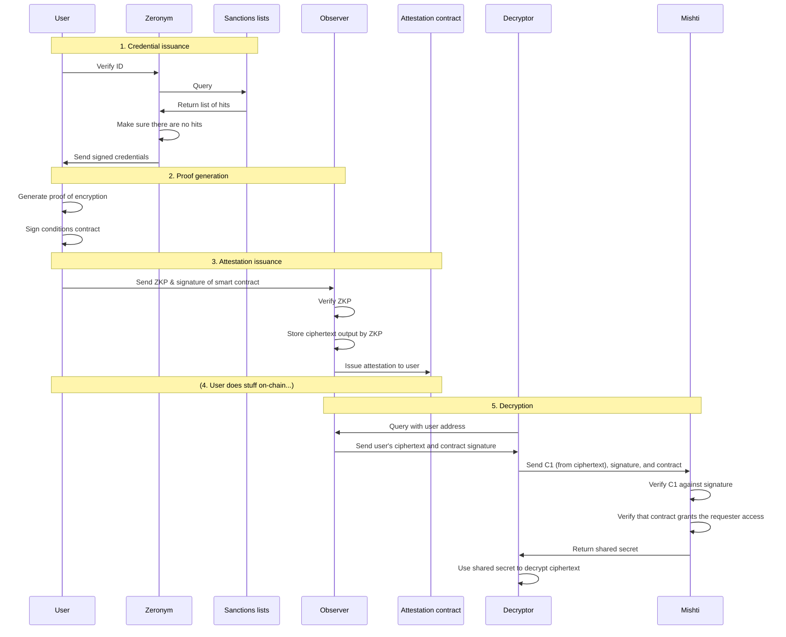

```mermaid
sequenceDiagram
    participant U as User
    participant Z as Zeronym
    participant S as Sanctions lists
    participant O as Observer
    participant A as Attestation contract
    participant D as Decryptor
    participant M as Mishti

    Note over U, S: 1. Credential issuance
    U->>Z: Verify ID
    Z->>S: Query
    S->>Z: Return list of hits
    Z->>Z: Make sure there are no hits
    Z->>U: Send signed credentials
    Note over U, O: 2. Proof generation
    U->>U: Generate proof of encryption
    U->>U: Sign conditions contract
    Note over U, A: 3. Attestation issuance
    U->>O: Send ZKP & signature of smart contract
    O->>O: Verify ZKP
    O->>O: Store ciphertext output by ZKP
    O->>A: Issue attestation to user
    Note over U, A: (4. User does stuff on-chain...)
    Note over O, M: 5. Decryption
    D->>O: Query with user address
    O->>D: Send user's ciphertext and contract signature
    D->>M: Send C1 (from ciphertext), signature, and contract
    M->>M: Verify C1 against signature
    M->>M: Verify that contract grants the requester access
    M->>D: Return shared secret
    D->>D: Use shared secret to decrypt ciphertext
```